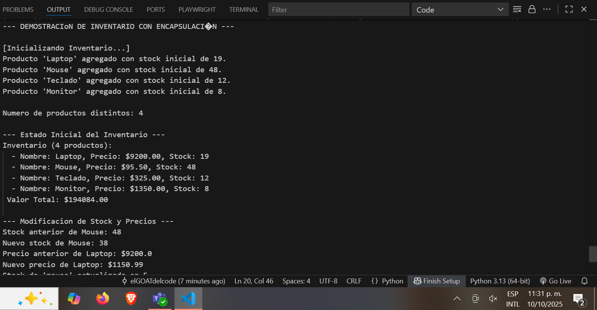
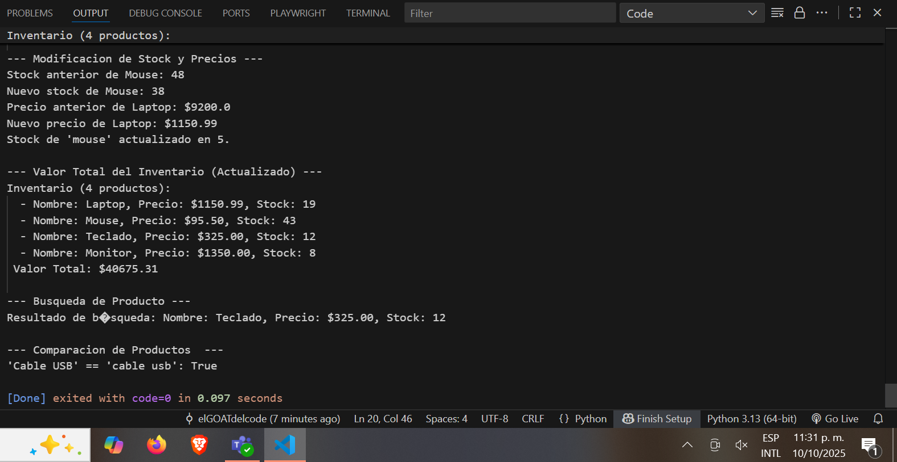

# Desarrollar una Clase Inventario

Este proyecto demuestra la implementación de la **Encapsulación** y **Abstracción** en Python utilizando las clases `Producto` e `Inventario`, cumpliendo con todos los requisitos de la tarea.

##  Diseño

El diseño se enfoca en hacer el código más seguro y simple de usar, siguiendo los principios de la POO.

### 1. Encapsulación 

Use la encapsulación para proteger los valores críticos* de cada producto:

* **Atributos Protegidos/Privados (`__stock` y `_precio`):** Marcados con `__` o `_` para indicar que no deben ser modificados directamente.
* **Getters y Setters (`@property`):** Uso estos métodos como **puertas de control** para cualquier cambio. esto permite validacion.

### 2. Abstracción 

La clase invetario sirve para encapsular gracias a los metodos sencillo implementados

## Capturas

  