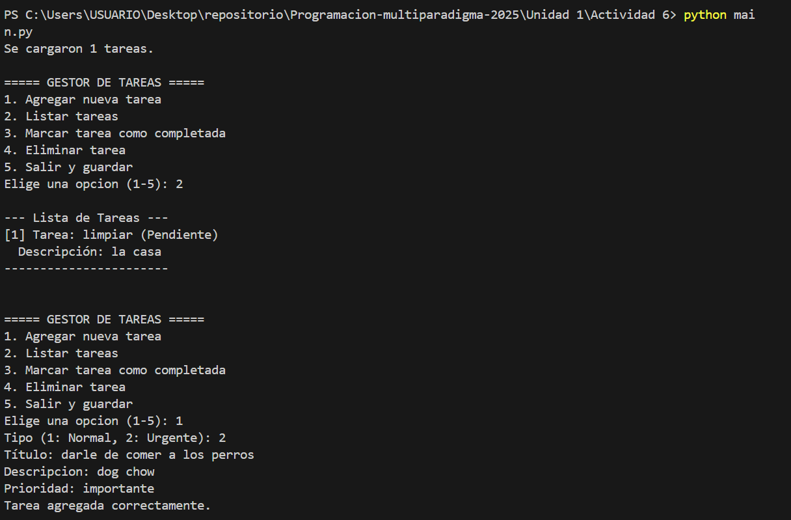
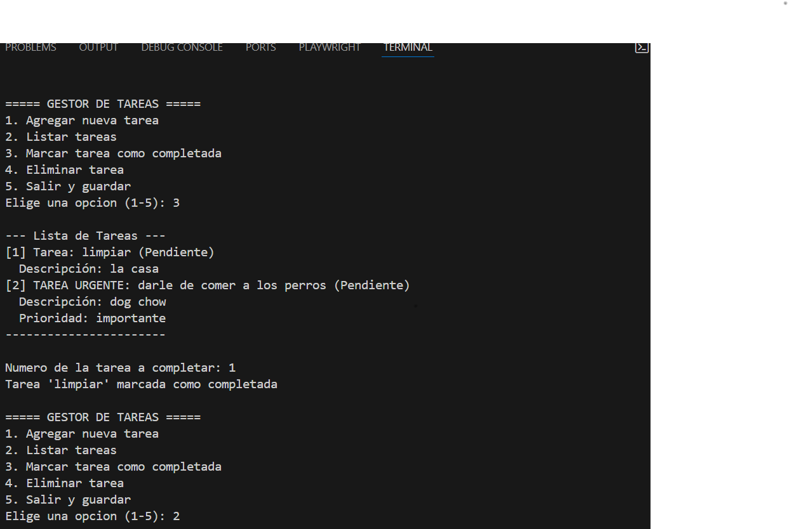
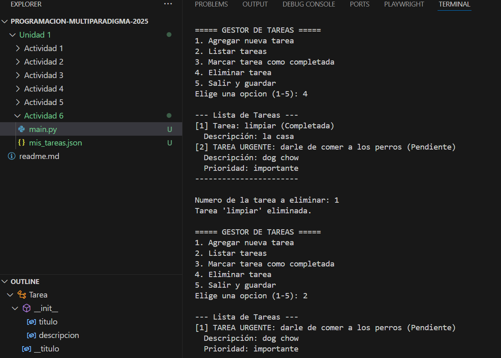

# Gestor de Tareas (Proyecto POO)
Este es un sencillo sistema de gestión de tareas personales desarrollado en Python, creado para aplicar los conceptos fundamentales de la (POO).

##  Instrucciones de Ejecución

El programa se ejecuta directamente desde la consola o terminal.

1.  **Requisitos:** Tener Python 3 instalado.
2.  Ejecutar: Abre una terminal, navega hasta la carpeta donde está el archivo y ejecuta el siguiente comando: python main.py
Sigue las instrucciones como se muestra en el menu

##  Explicación del Diseño (POO)

El sistema está estructurado usando tres clases principales para demostrar los pilares de la POO:

* **`Tarea` (Clase Base):**
    * Representa una tarea estándar. Usa encapsulamiento con atributos privados

* **`TareaUrgente` (Clase Hija):**
    Usa herencia y polimorfismo

* **`GestorTareas` (Clase Principal):**
    * Maneja la lógica del programa.

